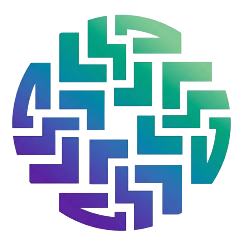
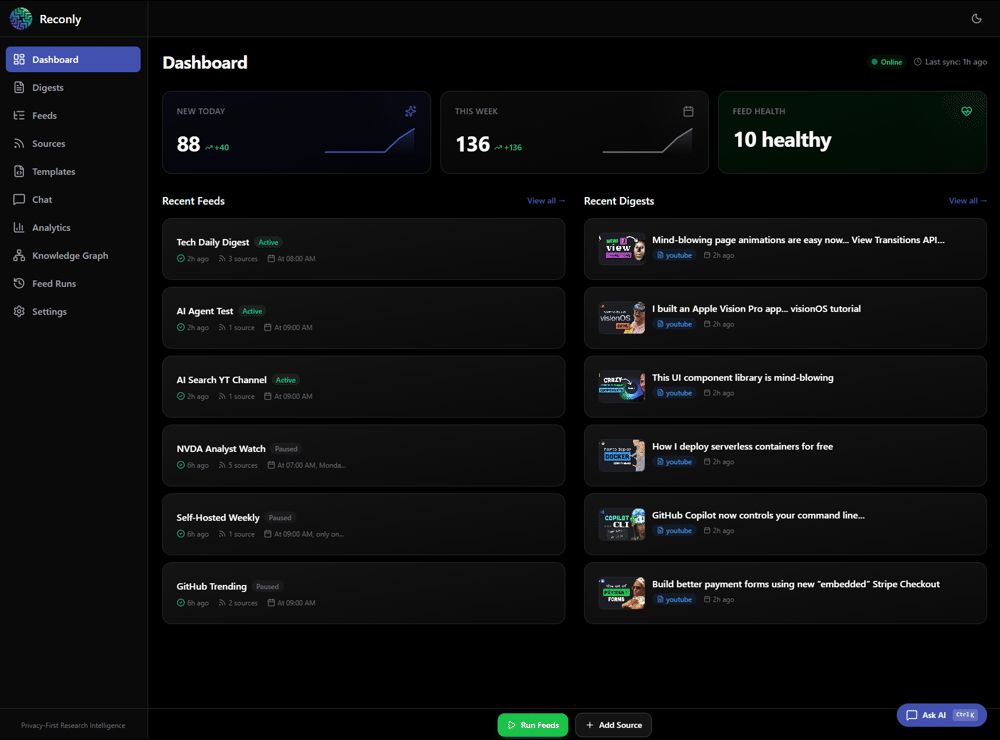

<p align="center">
  
</p>

<h1 align="center">Reconly</h1>

<p align="center">
  <strong>Privacy-first news & research intelligence</strong><br/>
  Aggregate all your sources, build knowledge in your system of choice, and keep full ownership of your data.
</p>

<p align="center">
  <a href="https://github.com/reconlyeu/reconly/actions/workflows/ci.yml"></a>
  <a href="LICENSE"></a>
  <!-- <a href="#"></a> -->
  <!-- <a href="#"></a> -->
</p>

<p align="center">
  
  <br/>
  <sub>
    <a href="docs/images/Dashboard.png">Dashboard</a> ·
    <a href="docs/images/Create%20Feed.png">Create Feed</a> ·
    <a href="docs/images/Digests.png">Digests</a> ·
    <a href="docs/images/Chat.png">Chat</a> ·
    <a href="docs/images/Knowledge.png">Knowledge Graph</a> ·
    <a href="docs/images/E-Mail.png">E-Mail Digest</a>
  </sub>
</p>

---

## Quick Start

```bash
git clone https://github.com/reconlyeu/reconly.git
cd reconly/docker/oss
cp .env.example .env
docker compose up -d
```

Open **http://localhost:8000** — sample feeds and digests ready to explore.

For AI summarization, install [Ollama](https://ollama.com) or [LM Studio](https://lmstudio.ai) (both free & local), or add a cloud API key. Then configure your provider and model in `.env` or via the UI at **Settings**.

---

## Why Reconly?

- **AI Research Agents** — Autonomous topic investigation on schedule, like a personal analyst
- **Multi-Source** — RSS, YouTube, websites, email, and AI agents in one place
- **RAG Knowledge System** — Semantic search across your archive with citations
- **Knowledge Graphs** — Visualize connections between topics
- **100% Private** — Run offline with Ollama/LM Studio + SearXNG. No cloud dependency
- **PKM Export** — Obsidian, Logseq, or any markdown-based system
- **Extensible** — Custom sources, LLM providers, and exporters via [plugins](https://github.com/reconlyeu/reconly-extensions)

---

## AI Providers

| Provider | Cost | Privacy | Setup |
|----------|------|---------|-------|
| Ollama / LM Studio | Free | 100% Local | [5 min setup](docs/setup.md#option-a-ollama-local-free-private) |
| HuggingFace | Free tier | Cloud | API key |
| OpenAI | ~$0.02/article | Cloud | API key |
| Anthropic | ~$0.04/article | Cloud | API key |

**Recommendation:** Start with [Ollama](https://ollama.com/) or [LM Studio](https://lmstudio.ai/) for free, private summarization.

---

## Documentation

| | |
|---|---|
| [Setup Guide](docs/setup.md) | Installation, database, AI providers |
| [AI Research Agents](docs/sources/agent-research-source.md) | Autonomous research configuration |
| [RAG & Knowledge Graph](docs/rag-setup.md) | Semantic search, embeddings |
| [Configuration](docs/configuration.md) | All environment variables |
| [API Reference](docs/api.md) | REST endpoints |
| [Deployment](docs/deployment.md) | Production setup, Docker, Nginx |

---

## Support

- **Issues:** [GitHub Issues](https://github.com/reconlyeu/reconly/issues)
- **Discussions:** [GitHub Discussions](https://github.com/reconlyeu/reconly/discussions)
- **Enterprise:** Multi-user, SSO, managed hosting → [reconly.eu](https://reconly.eu)

---

## Contributing

We welcome contributions! See [CONTRIBUTING.md](CONTRIBUTING.md) for guidelines.

**License:** [AGPL-3.0](LICENSE)

<p align="center">
  <sub>Made with care for the self-hosting community</sub>
</p>
