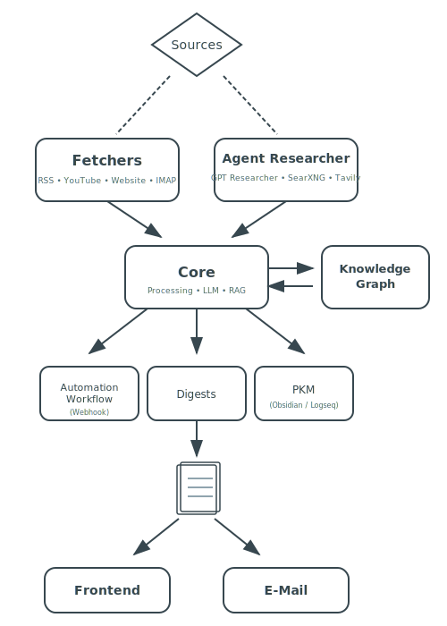

<p align="center">
  
</p>

<h1 align="center">Reconly</h1>

<p align="center">
  <strong>Privacy-first news & research intelligence</strong><br/>
  Aggregate all your sources, build knowledge in your system of choice, and keep full ownership of your data.
</p>

<p align="center">
  <a href="https://github.com/reconlyeu/reconly/actions/workflows/ci.yml"></a>
  <a href="LICENSE"></a>
  <!-- <a href="#"></a> -->
  <!-- <a href="#"></a> -->
</p>

<p align="center">
  
  <br/>
  <sub>
    <a href="docs/images/Dashboard.png">Dashboard</a> ·
    <a href="docs/images/Create%20Feed.png">Create Feed</a> ·
    <a href="docs/images/Digests.png">Digests</a> ·
    <a href="docs/images/Chat.png">Chat</a> ·
    <a href="docs/images/Knowledge.png">Knowledge Graph</a> ·
    <a href="docs/images/E-Mail.png">E-Mail Digest</a>
  </sub>
</p>

---

## Quick Start

**1. Set up Ollama** (for AI summarization)
```bash
# Install from https://ollama.com/download, then:
ollama pull qwen2.5:7b
```

**2. Start Reconly**
```bash
git clone https://github.com/reconlyeu/reconly.git
cd reconly/docker/oss
cp .env.example .env
docker compose up -d
```

Open **http://localhost:8000** — the getting started wizard will guide you through creating your first feed.

> **Alternative LLM options:** [LM Studio](https://lmstudio.ai) (local), or cloud APIs (Anthropic, OpenAI) — configure in `.env`

**Want more features?** See the [Feature Setup Guide](docs/feature-setup-guide.md) to enable semantic search, AI research agents, email fetching, and more.

---

## Why Reconly?

- **AI Research Agents** — Autonomous topic investigation on schedule, like a personal analyst
- **Multi-Source** — RSS, YouTube, websites, email, and AI agents in one place
- **RAG Knowledge System** — Semantic search across your archive with citations
- **Knowledge Graphs** — Visualize connections between topics
- **100% Private** — Run offline with Ollama/LM Studio + SearXNG. No cloud dependency
- **PKM Export** — Obsidian, Logseq, or any markdown-based system
- **Extensible** — Custom sources, LLM providers, and exporters via [plugins](https://github.com/reconlyeu/reconly-extensions)

---

## Architecture

Reconly combines traditional feed aggregation with autonomous AI research. Fetchers pull content from RSS, YouTube, websites, and email, while Agent Researchers actively investigate topics using search engines and GPT Researcher. All content flows through a unified processing pipeline for summarization, embedding, and knowledge extraction.

<p align="center">
  <picture>
    <source media="(prefers-color-scheme: dark)" srcset="docs/images/architecture-dark.svg">
    <source media="(prefers-color-scheme: light)" srcset="docs/images/architecture-light.svg">
    
  </picture>
</p>

1. **Sources** — Define what to monitor: RSS feeds, YouTube channels, websites, email inboxes, or research topics
2. **Fetchers & Agents** — Fetchers pull content on schedule; [GPT Researcher](https://gptr.dev) agents autonomously investigate topics via [SearXNG](https://searxng.org) or [Tavily](https://tavily.com)
3. **Core Processing** — Summarize with your LLM of choice, generate embeddings for RAG, extract entities for the knowledge graph
4. **Export** — Trigger webhooks for automation, generate digests for the frontend or email, sync to your PKM ([Obsidian](https://obsidian.md)/[Logseq](https://logseq.com))

---

## AI Providers

| Provider | Cost | Privacy | Setup |
|----------|------|---------|-------|
| Ollama / LM Studio | Free | 100% Local | [5 min setup](docs/setup.md#option-a-ollama-local-free-private) |
| HuggingFace | Free tier | Cloud | API key |
| OpenAI | ~$0.02/article | Cloud | API key |
| Anthropic | ~$0.04/article | Cloud | API key |

**Recommendation:** Start with [Ollama](https://ollama.com/) or [LM Studio](https://lmstudio.ai/) for free, private summarization.

---

## Documentation

| | |
|---|---|
| [Setup Guide](docs/setup.md) | Installation, database, AI providers |
| [Feature Setup Guide](docs/feature-setup-guide.md) | Enable RAG, agents, email, and more |
| [AI Research Agents](docs/sources/agent-research-source.md) | Autonomous research configuration |
| [RAG & Knowledge Graph](docs/rag-setup.md) | Semantic search, embeddings |
| [Configuration](docs/configuration.md) | All environment variables |
| [API Reference](docs/api.md) | REST endpoints |
| [Deployment](docs/deployment.md) | Production setup, Docker, Nginx |

---

## Support

- **Issues:** [GitHub Issues](https://github.com/reconlyeu/reconly/issues)
- **Discussions:** [GitHub Discussions](https://github.com/reconlyeu/reconly/discussions)
- **Enterprise:** Multi-user, SSO, managed hosting → [reconly.eu](https://reconly.eu)

---

## Contributing

We welcome contributions! See [CONTRIBUTING.md](CONTRIBUTING.md) for guidelines.

---

## Acknowledgements

Reconly is built on the shoulders of these excellent open source projects:

- [Ollama](https://ollama.com) / [LM Studio](https://lmstudio.ai) — Local LLM inference
- [GPT Researcher](https://gptr.dev) — Autonomous research agents
- [SearXNG](https://searxng.org) — Privacy-respecting metasearch
- [pgvector](https://github.com/pgvector/pgvector) — Vector similarity search for PostgreSQL
- [FastAPI](https://fastapi.tiangolo.com) — Modern Python web framework
- [Vue.js](https://vuejs.org) / [Astro](https://astro.build) — Frontend frameworks

---

**License:** [AGPL-3.0](LICENSE)

<p align="center">
  <sub>Made with care for the self-hosting community</sub>
</p>
